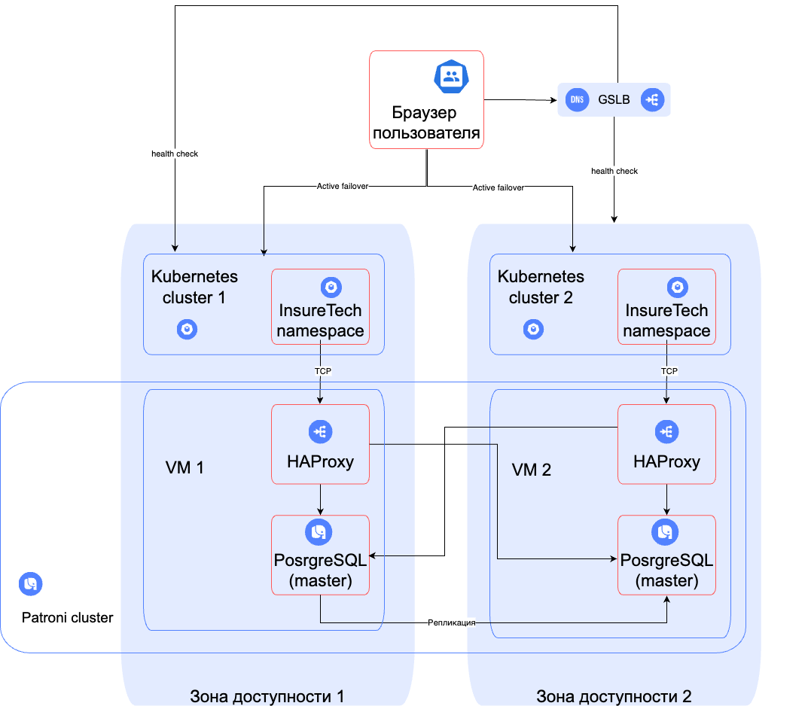

### Стратегия масштабирования и отказоустойчивости

Согласно требованиям бизнеса, компания хочет сделать упор на развитие в регионах РФ
и доступность приложения должна быть равна 99,9%, 
такую высокую доступность может обеспечить стратегия Active-Active с георезервированием.
На каждом ЦОД будет развернут независимый кластер Kubernetes,
что поможет обеспечить быструю работу приложения в любом регионе.
Также, для обеспечения требований высокой доступности для конфигурации БД используется Patroni.
Шардирование на данном этапе не нужно, т.к. объем данных вВ шардировании на данном этапе нет необходимости.
